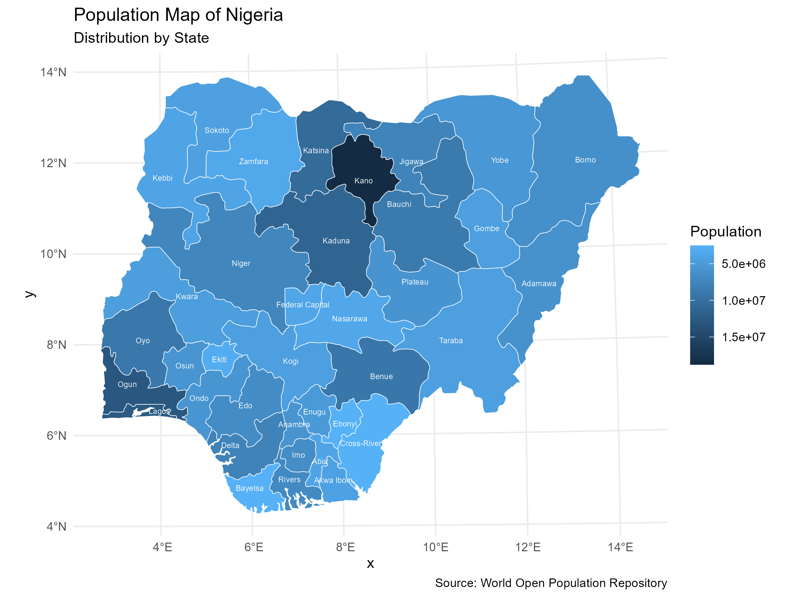

# Nigeria Spatial Analysis & Population Mapping in R



This repository contains an R script for spatial visualization and demographic analysis of Nigeria. It demonstrates how to fetch international administrative boundary data, load local shapefiles (`.shp`), perform data cleaning/joining operations, and generate a polished choropleth map using `ggplot2` and `sf`.

## 📌 Features
* **Automated Boundary Fetching:** Downloads country and state boundaries dynamically via `rnaturalearth`.
* **Layered Geospatial Plots:** Integrates local government boundaries (LGAs) and inland hydrological/water bodies.
* **Demographic Mapping:** Blends spatial data frames with population datasets via `dplyr` Joins.
* **Data Harmonization:** Cleans string variables by removing whitespace and rectifying spelling mismatches across text-heavy attributes.
* **Coordinate Transformation:** Projects data arrays to `EPSG:32631` (WGS 84 / UTM zone 31N) for localized geometric accuracy.

## 📁 Repository Structure
```text
├── mapping_script.R    # The core R script containing geospatial workflows
└── README.md           # Documentation for project setup
```

## 🛠️ Prerequisites & Installation

To run this script locally, ensure you have **R** installed alongside the following dependencies. You can install them by running this command in your R console:

```R
install.packages(c("sf", "ggplot2", "dplyr", "stringr", "rnaturalearth", "rnaturalearthdata"))
```

### External Data Requirements
The pipeline references data downloaded locally to your computer. Before running the script, update the absolute file paths to point to your respective directories for:
1. **Administrative Boundaries:** Nigeria LGA Level-2 shapefiles (`NGA_adm2.shp`).
2. **Water Lines/Areas:** Digital Chart of the World (DCW) data for Nigeria (`NGA_water_areas_dcw.shp`).
3. **WOPR Population Datasets:** Total scaled population outputs from the World Open Population Repository (`states_pop_total_scaled.csv`).

## 🚀 Usage

Open `mapping_script.R` in RStudio, set your file paths, and execute the lines sequentially. 

The core output is a clean choropleth map highlighting the distribution of the population by state across the country:

* **High-density states** are automatically highlighted by reversed continuous color scales.
* **State borders** are separated by sharp white grid line delineations.
* **Labels** are programmatically applied to state centroids using title casing.

## 🤝 Contributing
Contributions, issues, and feature requests are welcome! Feel free to check the issues page if you want to request adjustments or optimizations.
