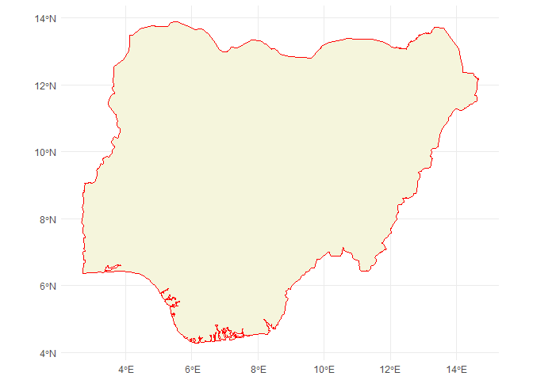
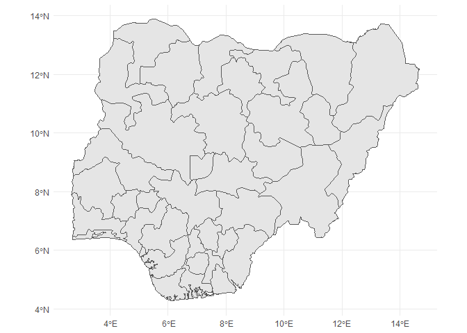
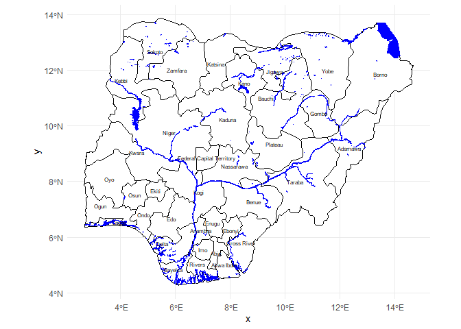
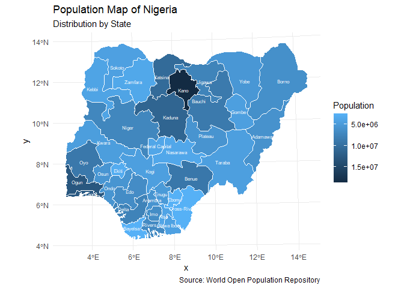

# Nigeria Population and Spatial Visualization Map

This project downloads and plots administrative boundaries, water lines, and WOPR population data for Nigeria using `ggplot2` and `sf`.

## 🛠️ Load Packages
We use `pacman::p_load` to check, install, and load all necessary libraries.

```r
if (!require("pacman")) install.packages("pacman")
pacman::p_load(tidyverse, inspectdf, plotly, janitor, visdat, esquisse, survey, srvyr,
               gtsummary, likert, tidytext, sf, malariaAtlas, rnaturalearth)
```

---

## 🗺️ 1. Getting Administrative Boundaries using rnaturalearthdata

### Country Boundary
```r
nigeria <- ne_countries(scale = 10, country = "Nigeria", returnclass = "sf")
print(as_tibble(nigeria))

ggplot() +
  geom_sf(data = nigeria, color = 'red', fill = 'beige') +
  theme_minimal()
```



### State Boundaries
```r
stateboundaries <- ne_states(country = "Nigeria", returnclass = "sf") 
ggplot() +
  geom_sf(data = stateboundaries) +
  theme_minimal()
```



### Local Government Boundaries
```r
Nig_LG <- st_read("C:/Users/OLALERU/Desktop/New folder/New folder/Desktop/gis/NGA_adm/NGA_adm2.shp")
Nig_LG <- Nig_LG %>% select(statename = NAME_1, Lg = NAME_2, everything())
```

---

## 🌊 2. Loading Nigeria Water Boundaries
```r
Water_NIG <- st_read("C:/Users/OLALERU/Desktop/R_EZEKIEL/data_input/NGA_wat/NGA_water_lines_dcw.shp")
Water_NIG2 <- st_read("C:/Users/OLALERU/Desktop/R_EZEKIEL/data_input/NGA_wat/NGA_water_areas_dcw.shp")
```

### Visualizing Water Areas Over State Boundaries
```r
ggplot() + 
  geom_sf(data = stateboundaries, color = 'black', fill = 'white') +
  geom_sf(data = filter(Water_NIG2, !is.na(NAME)), fill = 'blue', color = 'blue') +
  geom_sf_text(data = stateboundaries, aes(label = name), size = 2, colour = 'black') +
  theme_minimal()
```



---

## 📊 3. Working with Population Data (WOPR)
```r
Nig_pop <- read.csv("C:/Users/OLALERU/Desktop/R_EZEKIEL/data_input/Pop/lga_pop_total_scaled.csv")
s_Population <- read.csv("C:/Users/OLALERU/Desktop/R_EZEKIEL/data_input/Pop/states_pop_total_scaled.csv")

Nigpopulation <- Nig_LG %>% 
  left_join(Nig_pop, by = "statename")
```

---

## 🧼 4. Preparing State Data and Text Cleaning
```r
stateboundaries <- stateboundaries %>% select(statename = name, latitude, longitude, geometry)

stateboundaries <- stateboundaries %>% mutate(statename = str_to_title(str_trim(statename)))
s_Population <- s_Population %>% mutate(statename = str_to_title(str_trim(statename)))

# Switched to recode_values to match updated package requirements cleanly
stateboundaries <- stateboundaries %>% mutate(statename = recode_values(statename,
  "Nassarawa"                 ~ "Nasarawa", 
  "Federal Capital Territory" ~ "Federal Capital",
  "Cross River"               ~ "Cross-River"
))

statepopulation <- stateboundaries %>% left_join(s_Population, by = "statename")
```

---

## 📐 5. Coordinate Transformations
```r
Nigpopulation <- st_transform(Nigpopulation, crs = 32631)
stateboundaries <- st_transform(stateboundaries, crs = 32631)
statepopulation <- st_transform(statepopulation, crs = 32631)
```

---

## 📍 6. Final Population Map of Nigeria

This maps population densities directly onto state geometries, matching your desired visual expectations layout on your GitHub landing page.

```r
ggplot() +
  geom_sf(data = statepopulation, aes(fill = population), color = "white", size = 0.2) + 
  scale_fill_continuous(name = "Population", trans = "reverse") +
  geom_sf_text(data = statepopulation, aes(label = statename), size = 2, colour = 'white') +
  theme_minimal() +
  labs(title = "Population Map of Nigeria",
       subtitle = "Distribution by State",
       caption = "Source: World Open Population Repository")

ggsave("nigeria_population_map.png", width = 8, height = 6, dpi = 300)
```


